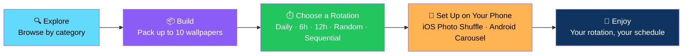
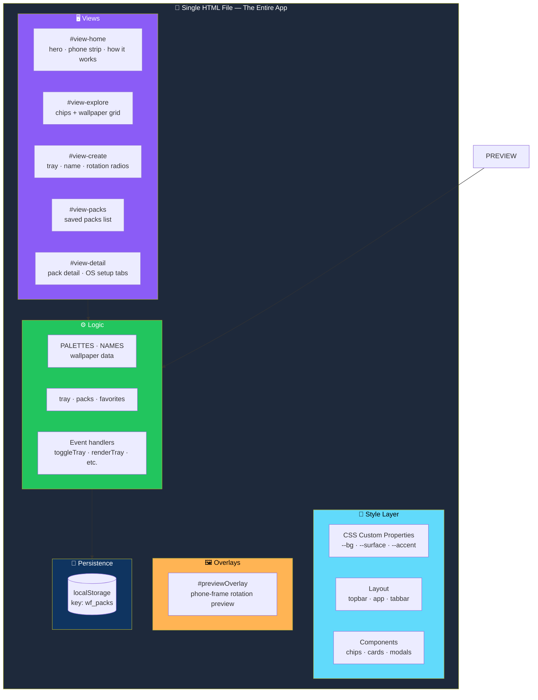

# 🎨 WallFlow

<div align="center">


**Your wallpaper. Your rotation.**

*A mobile-first web app for creating personalized wallpaper collections and rotating them on your phone on your own schedule.*

[✨ Features](#-features) • [🏗️ Architecture](#️-architecture) • [🚀 Getting Started](#-getting-started) • [🎮 How It Works](#-how-it-works) • [🎨 Customization](#-customization)

</div>

---

## 📖 Overview

**WallFlow** is a **mobile-first web app** for creating personalized wallpaper collections and rotating them on your phone on your own schedule.

Browse curated gradient wallpapers by category, build packs of up to **10 wallpapers**, choose a rotation interval, and follow the platform-specific setup guide to bring your rotation to life.

### Core Idea

> **Websites can't silently change your phone's system wallpaper.**
>
> iOS and Android each require a short manual step — WallFlow guides you through it.

### The Flow



---

## ✨ Features

<div align="center">

| 🔍 Explore Wallpapers | 📦 Build Custom Packs |
|:---:|:---:|
| **24 curated wallpapers** across **12 categories** | Add up to **10 wallpapers** per pack · name it · pick a rotation style |
| **⏱️ Rotation Options** | **❤️ Favorites** |
| Daily · Every 6 hours · Every 12 hours · Random · Sequential | Heart any wallpaper to keep track of the ones you love |
| **👁️ Preview Rotation** | **💾 Persistent Packs** |
| Step through your pack in a phone-frame preview with swipe support | Packs are saved to `localStorage` — they survive page reloads |
| **📱 Platform Setup Guides** | **🎨 Mobile-First UI** |
| Step-by-step instructions for iPhone *(Photo Shuffle)* and Android *(Wallpaper carousel / shuffle apps)* | Safe-area aware · sticky top bar · bottom tab bar · dark theme by default |

</div>

### 🗂️ The 12 Categories

| | | | |
|:---:|:---:|:---:|:---:|
| 🌿 **Nature** | 🎨 **Abstract** | ⬜ **Minimal** | 🌸 **Anime** |
| 🚀 **Space** | 🚗 **Cars** | 🏛️ **Architecture** | 🌑 **Dark** |
| 🌈 **Gradient** | 🎮 **Gaming** | 🏙️ **City** | ❄️ **Seasonal** |

---

## 🛠️ Tech Stack

<div align="center">

| Layer | Technology |
|-------|-----------|
| **Structure** | Pure HTML — no build step, no dependencies, no framework |
| **Styling** | CSS3 with custom properties for theming |
| **Logic** | Vanilla JavaScript |
| **Typography** | [Space Grotesk](https://fonts.google.com/specimen/Space+Grotesk) for headings · [Inter](https://fonts.google.com/specimen/Inter) for body |
| **Theming** | CSS custom properties — `--bg`, `--surface`, `--accent`, etc. |
| **Persistence** | `localStorage` under the key `wf_packs` |

</div>

> 💡 **No build step. No bundler. No dependencies.**

---

## 🚀 Getting Started

### Option 1 — Just Open It

1. **Download or clone** the project
2. **Open the HTML file directly** in any modern browser — no server required

### Option 2 — Serve It Locally

```bash
# Python 3
python -m http.server 8000

# Node.js (with npx)
npx serve
```

Then visit **`http://localhost:8000`** and start exploring.

---

## 🎮 How It Works

### 1️⃣ Pick Up to 10 Wallpapers

Head to **Explore**, filter by category using the chips, and:

- Tap **+** on any wallpaper to add it to your pack-in-progress
- Tap **♡** to favorite it

### 2️⃣ Choose a Rotation

Go to **Create**, give your pack a name, and select a rotation interval:

| Rotation | Behavior |
|----------|----------|
| **Daily** | Changes every 24 hours |
| **Every 6 hours** | Changes 4 times a day |
| **Every 12 hours** | Changes twice a day |
| **Random** | Random pick each time |
| **Sequential** | Plays 1 → 2 → 3 → repeat |

### 3️⃣ Set It Up on Your Phone

Open your pack from **My packs** and follow the tabbed guide for your platform.

#### 📱 iPhone

1. **Download this pack's images** from the pack page
2. Open Photos and save all downloaded wallpapers into **one album**
3. Go to **Settings → Wallpaper → Add New Wallpaper → Photo Shuffle**
4. Select your saved album as the shuffle source
5. Choose how often it shuffles *(on tap, hourly, or daily)* and set it as your Lock Screen or Home Screen

#### 🤖 Android

1. **Download this pack's images** to your device
2. Open **Settings → Wallpaper & style** *(steps vary by manufacturer)*
3. Choose **"Wallpaper carousel"** or **"Photo shuffle"** if your device offers it — or install a wallpaper-rotation app from the Play Store
4. Select your downloaded images as the source folder
5. Set the change frequency your device or app supports

---

## 🏗️ Architecture

### Everything in One File



### Section Reference

| Section | Purpose |
|---------|---------|
| **`<style>`** | All CSS — theming, layout, components, animations |
| **`.topbar`** | Fixed header with brand and selection counter |
| **`.app`** | Main scroll container holding all views |
| **`#view-home`** | Hero, phone strip preview, "How it works" |
| **`#view-explore`** | Category chips + wallpaper grid |
| **`#view-create`** | Pack builder — tray, name field, rotation radios |
| **`#view-packs`** | List of saved packs |
| **`#view-detail`** | Pack detail, preview button, OS setup tabs |
| **`.tabbar`** | Bottom navigation — Home / Explore / Create / Packs |
| **`#previewOverlay`** | Fullscreen phone-frame rotation preview |
| **`<script>`** | App logic — data, rendering, state, event handlers |

### Project Structure

```
wallflow/
├── index.html      # the app (HTML + CSS + JS in one file)
└── README.md       # this file
```

### Design Principles

<div align="center">

| Principle | Implementation |
|-----------|---------------|
| **📄 One file, zero dependencies** | The whole app is one HTML file — portable, shareable, no build step |
| **📱 Mobile-first** | Safe-area aware, sticky top bar, bottom tab bar — designed for phones first |
| **🌑 Dark theme by default** | The app lives in the visual space of the wallpapers it shows |
| **💾 Persistence without a backend** | `localStorage` under `wf_packs` — packs survive reloads |
| **📖 Guides, not magic** | The app tells the truth: browsers can't set system wallpapers — so it walks you through the manual steps |
| **🎨 Theming as data** | Every color lives in a CSS variable — restyle the whole app by editing one block |
| **🧩 Wallpapers as data** | Every wallpaper is a gradient defined in `PALETTES` — add categories by editing one object |

</div>

---

## 🎨 Customization

### ➕ Add or Change Wallpaper Categories

Edit the **`PALETTES`** object near the top of the `<script>`:

```js
const PALETTES = {
  Nature: ['#1e5631,#4e9f3d', '#0f3d3e,#2f9e77'],
  // Add a new category:
  Retro: ['#ff6b6b,#feca57', '#5f27cd,#ff9ff3'],
};
```

> 💡 **Each entry is an array of gradient strings** in `#startColor,#endColor` format.
>
> **Every gradient becomes a wallpaper.**

### ✏️ Change Wallpaper Names

Edit the **`NAMES`** array:

```js
const NAMES = ['Neon Rain', 'Quiet Ridge', /* ... */];
```

### 📦 Adjust the Pack Size Limit

The default max is **10**. Change it in **two places**:

1. The guard in `toggleTray()`: `if (tray.length >= 10)`
2. The label in `renderTray()`: `` `${tray.length} / 10` ``

### 🎨 Restyle the Theme

All core colors are **CSS variables** at the top of the stylesheet:

```css
:root {
  --bg: #0c0c10;
  --surface: #17171c;
  --surface2: #1f1f26;
  --line: #2a2a33;
  --text: #f3f1ec;
  --dim: #8d8b93;
  --accent: #6c5ce7;
  --accent2: #a29bfe;
}
```

Change these values and **the entire app re-themes**.

---

## 🌐 Browser Support

**Works in all modern browsers that support:**

- ✅ CSS custom properties
- ✅ `backdrop-filter` *(for the frosted top/bottom bars)*
- ✅ `localStorage`
- ✅ Touch events *(for the swipe-to-navigate preview)*

> 💡 **Best experienced on mobile, but fully usable on desktop.**

---

## ⚠️ Known Limitations

<div align="center">

| Limitation | Details |
|-----------|---------|
| **No real system wallpaper control** | Browsers **cannot** set your phone's wallpaper. The setup guides walk you through the manual steps |
| **No image uploads yet** | The "upload your own" copy in the hero is **aspirational** — only the built-in gradient wallpapers are currently available |
| **No actual image files** | Wallpapers are **CSS gradients**, not downloadable images. The "Download" step in the guides is **illustrative** |
| **Share pack is a stub** | It shows a toast but **doesn't generate a real link** |
| **Packs are local only** | Stored in `localStorage` — they **don't sync** across devices or browsers |

</div>

> ⚠️ **We'd rather list what isn't there than ship a fake button.**

---

## 🗺️ Roadmap

### ✅ Current

- [x] 24 curated wallpapers across 12 categories
- [x] Category chips for filtering
- [x] Add up to 10 wallpapers to a pack
- [x] Name your pack
- [x] Five rotation options — Daily, Every 6 hours, Every 12 hours, Random, Sequential
- [x] Favorites with heart toggle
- [x] Phone-frame preview with swipe navigation
- [x] Persistent packs via `localStorage` under `wf_packs`
- [x] Platform setup guides for iOS and Android
- [x] Mobile-first layout with safe-area support
- [x] Sticky top bar and bottom tab bar
- [x] Dark theme by default
- [x] Single-file, zero-dependency, no build step

### 🔜 Roadmap Ideas

- [ ] **Real image uploads** and downloadable pack exports
- [ ] **Shareable pack links** — encode pack data in the URL
- [ ] **User accounts and cloud sync**
- [ ] More categories and wallpaper sources
- [ ] **Scheduled rotation reminders / notifications**
- [ ] **Light theme toggle**
- [ ] **PWA support** — offline use and install-to-homescreen

---

## 🤝 Contributing

Contributions are welcome. Please:

1. Fork the repository
2. **Keep it single-file** — no external build step or bundler
3. **Keep it dependency-free** — no frameworks, no npm packages
4. **Preserve the mobile-first layout** — safe-area aware, thumb-reachable
5. **Keep the guides honest** — if a step requires the user to do something manually, say so
6. **Never claim a feature that isn't built** — the Known Limitations section is the standard
7. Test on both mobile and desktop
8. Submit a Pull Request

### Guidelines

- **Never add a required external dependency**
- **Never store packs anywhere but `localStorage`** — the app is intentionally backend-free
- **Never break the gradient-only approach** without also shipping real image assets
- **Never restyle by adding new variables** — extend the existing CSS custom properties
- **Never ship the "share" stub as if it works** — either build it or leave it labeled

---

## 📜 License

**No license specified.**

> 💡 **Add one** *(e.g., MIT)* **if you plan to distribute or open-source this project.**

---

## 🙏 Acknowledgments

- **Fonts by** [Google Fonts](https://fonts.google.com/)
- **Design and code by** the WallFlow project

---

<div align="center">

### 🎨 PICK. BUILD. ROTATE. ENJOY.

**Your wallpaper. Your rotation.**

**One file. Zero dependencies. Mobile-first.**

<br>

⭐ If this app helped you, consider giving it a star.

<br>

[⬆ Back to Top](#-wallflow)

</div>
